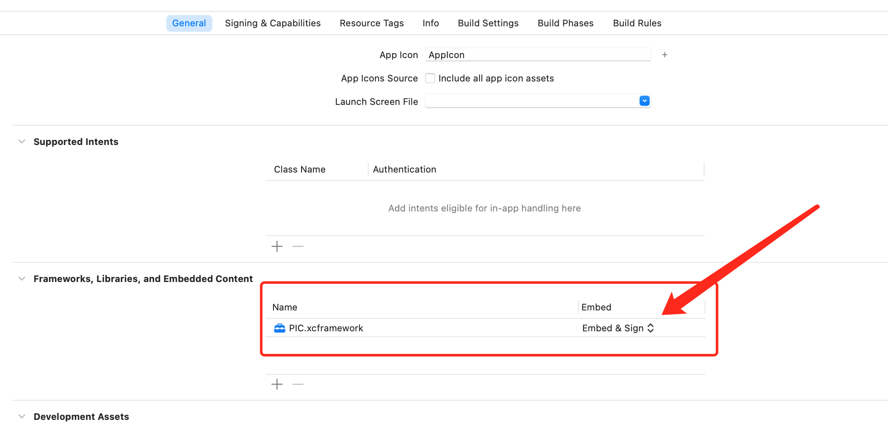

项目： Personal information certification

# PicRPA SDK 接口文档

## 概述
PicRPA SDK 提供了一系列接口，用于与PicRPA平台进行交互，包括获取平台列表、启动SDK视图以及消息监听等功能。

## 配置
在开始使用SDK之前，需要配置以下参数：
- `sdkUrl`：服务地址，用于SDK与PicRPA平台通信。
- `key`：授权键，用于验证客户端的合法性。
- `secret`：授权码，用于进一步加强安全性。


## 接入SDK

* 在工程中直接加入`PIC.xcframework` 
* 在Frameworks, Libraries, and Embedded Content 中 将 `PIC.xcframework` 设置为 `Embed & Sign`



## 接口方法


## 平台列表方法

-------------------
> 获取PicRPA支持的平台列表。

##### 请求参数
| 参数名称 | 是否必填 | 字段类型   | 参数说明 |
|------|------|--------|------|
| urlStr | 是    | string | 服务器地址 |
| key   | 是    | string | 授权键  |
| secret   | 是    | string | 授权码  |


##### 回调结果 类型 Map<String, Any>
| 参数名称  | 是否返回 | 字段类型   | 描述   |
|-------|-----|--------|------|
| id    | 是    | int    | 平台ID |
| title | 是   | string | 平台名称 |
###### Swift代码示例：
```swift
// fetch platform list
PICSDK.shared.fetchPlatForm(urlStr: sdkUrl, key: key, secret: secret) { list, err in
    if let list = list {
        // list.first?.id
        // list.first?.title
    }else{
        debugPrint(err)
    }
}
````


## 启动SDK视图方法

-------------------
> 在当前运行的ViewController中启动PicRPA SDK视图


##### 请求参数
| 参数名称 | 是否必填 | 字段类型     | 参数说明            |
|------|------|----------|-----------------|
| urlStr | 是    | string   | 服务器地址           |
| key   | 是    | string   | 授权键             |
| secret   | 是    | string   | 授权码             |
| id   | 是    | int      | 平台ID            |
| params   | 是    | Map<String, Any>   | 启动参数<详见参数配置>    |

###### Swift代码示例：
```swift
// 设置SDK 回调
PICSDK.shared.delegate = self
// 打开SDK
PICSDK.shared.openPIC(urlStr: sdkUrl, key: key, secret: secret, id: model.id, parmas: params) { success in
    debugPrint("open success \(success)")
}
````

##### 参数配置：Params: [String : Any]
| 枚举名       | 枚举值     | 参数说明          |
|-----------|---------|---------------|
| IsCache   | IsCache | 是否缓存页面        |
| IsLogout  | IsLogout  | 是否退出已登录状态     |
| TimeOut   | TimeOut  | 页面运行有效时间（单位秒） |

###### Swift代码示例：
```kotlin
let params : [String : Any] = [
    "IsCache": false,  // 是否缓存页面
    "IsLogout": true, // 是否退出已登录状态
    "TimeOut": 60      // 页面运行有效时间
]
````


##### 设置回调方法
| 回调方法签名 | 方法说明  |
|-----------|---------|
| **func** onNext(msg: String) | 执行过程事件  |
| **func** onError(msg: String) | 错误信息    |
| **func** onResult(msg: String, data: String?) | 关闭并回调结果 |

##### 结果回调信息： 
| 参数名称    | 是否返回 | 字段类型   | 描述                  |
|---------|------|--------|---------------------|
| msg | 是    | string    | 返回的消息               |
| data    | 否    | string | 数据处理完毕返回的JSON格式的字符串 |

###### Swift回调代码示例：
```swift
// 前面设置过代理 PICSDK.shared.delegate = self
extension ViewController: PICSDKDelegate{
  /*
  * 用于回调执行过程中的事件: 容器 > 方法名 > 参数
  * 打开三方App事件  onNext: WebView > onStartActivityUrl > url
  * 其他事件回调     onNext: WebView > onEvent > 字符串"
  */
    func onNext(msg: String) {
        debugPrint("===============> onNext: \(msg)")
    }
  
  /*
  * 用于回调执行过程中的错误: 容器 > 方法名 > 参数
  * 打开三方App失败  onError: WebView > onStartActivityUrl > Error: url
  */
    func onError(msg: String) {
        debugPrint("===============> onError: \(msg)")
    }
  
  /*
  * 用于回调执行完毕后的结果:
  * 成功时msg是"success",data为返回的信息
  * 失败时msg是"fail",data为nil
  * 取消时msg是"cancel",data为nil
	*/
    func onResult(msg: String, data: String?) {
        debugPrint("===============> onResult: \(msg), data: \(data ?? "")")
    }
}
````